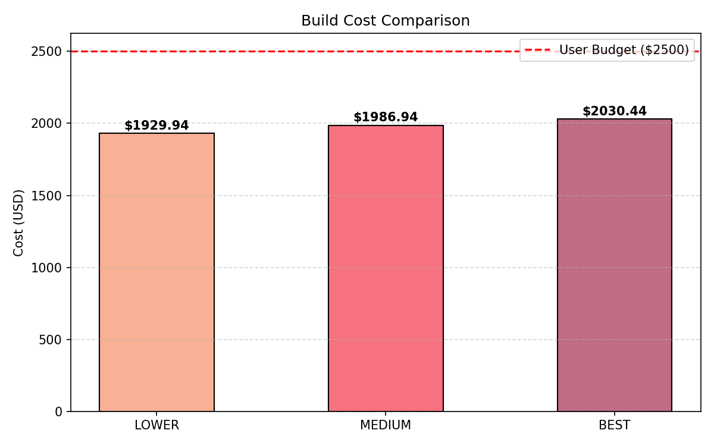
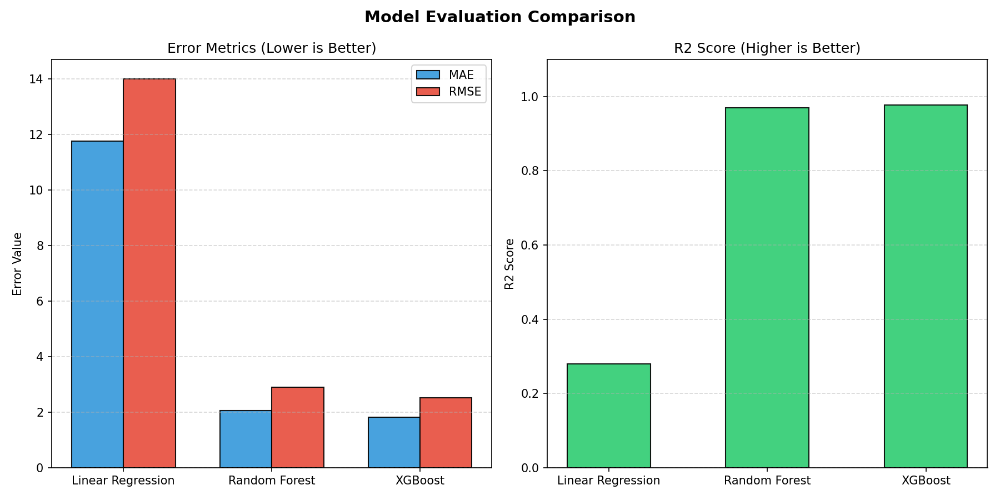

# AI-Based PC Build Recommendation System

[](https://www.python.org/)
[](https://opensource.org/licenses/MIT)
[](https://streamlit.io/)

A complete, end-to-end AI-powered PC recommendation system that matches users with optimal, physically and electrically compatible PC builds based on their budget (USD) and purpose (Gaming, Editing, Office). The project features both an interactive CLI console application and a custom, premium dark-themed Streamlit multi-page web dashboard with interactive visualizations.

---

## 🌟 Project Overview
Building a PC can be overwhelming due to compatibility issues, budget constraints, and pricing variations. This project solves these challenges by combining a heuristic rule-based validation engine with Machine Learning (XGBoost, Random Forest, Linear Regression) and Cosine Similarity models. It dynamically calculates component suitability scores, validates socket and power margins, and predicts final build quality.

---

## 🚀 Key Features

*   **Cosine Similarity Matching**: Ranks components (CPUs, GPUs, Motherboards, RAM, Storage, PSUs) against ideal vector representations calculated from allocated budgets and purpose-specific weights.
*   **Compatibility Validation Engine**: Enforces strict hardware rules before recommending configurations:
    *   *Socket Alignment*: CPU socket matches Motherboard socket.
    *   *Memory Standard Match*: RAM generation matches Motherboard memory slots (e.g., DDR4 vs. DDR5).
    *   *Power Safety Margin*: PSU Wattage $\ge 1.30 \times (\text{CPU TDP} + \text{GPU Power Draw})$ providing a safe 30% overhead.
*   **AI Build Score & Penalty System**: Evaluates and ranks generated builds using a multi-factor weighting formula:
    *   **40%** Performance Score
    *   **30%** Budget Efficiency
    *   **20%** Purpose Alignment
    *   **10%** Compatibility
    *   *Over-Budget Penalty*: Dynamically reduces scores for builds exceeding the target budget (using a linear + quadratic penalty model) to prevent selecting expensive configurations.
*   **Machine Learning Predictors**: Recommends configurations and predicts an `overall_build_quality` score (0-100) using regression models trained on a synthetic database of 10,000 builds.
*   **Premium Web Dashboard**: A modern, dark-themed dashboard built with Streamlit featuring:
    *   *Home / Build Engine*: Interactive form to input budget and preferences.
    *   *Recommendations Page*: Multi-tier configuration cards (Lower, Medium, Best Grade), specs sheets, component-level choice explanations, and a Plotly budget gauge.
    *   *Model Evaluation*: Programmatic comparison of MAE, RMSE, and R² scores, residual error plots, and feature importance charts.
    *   *Dataset Insights*: Deep-dive component distribution analysis and inventory statistics.

---

## 🛠️ Technologies Used

*   **Core Logic & Analytics**: `Python`, `pandas`, `numpy`, `joblib`
*   **Machine Learning**: `scikit-learn`, `xgboost`
*   **Visualizations**: `matplotlib`, `plotly`
*   **Frontend UI**: `Streamlit`, HTML5, CSS3 (Vanilla Dark Theme Customization)

---

## 📊 Machine Learning Models Used

Three models are trained and evaluated on 10,000 synthetic build samples:
1.  **Linear Regression**: Serves as the baseline model.
2.  **Random Forest Regressor**: Captures non-linear component combinations.
3.  **XGBoost Regressor** *(Best Model Selected)*: Consistently delivers the highest accuracy ($R^2 \approx 0.99$, lowest MAE/RMSE). It is programmatically selected to predict the build quality of generated configurations.

---

## 📂 Project Structure

```directory
PROJECT_ROOT/
│
├── .streamlit/
│   └── config.toml             # Custom theme configuration for Streamlit
│
├── DATASET/                    # CSV component files
│   ├── CPU_DATA.csv
│   ├── GPU_DATA.csv
│   ├── MOTHERBOARD_DATA.csv
│   ├── PSU_DATA.csv
│   ├── RAM_DATA.csv
│   └── STORAGE_DATA.csv
│
├── src/                        # Modular source code
│   ├── __init__.py
│   ├── budget_engine.py        # Purpose-based budget allocations
│   ├── build_generator.py      # Backtracking solver & early pruning
│   ├── compatibility_engine.py # Hardware rule validator
│   ├── data_loader.py          # Dynamic file search and load utility
│   ├── evaluate_models.py      # Validation visualizations generator
│   ├── feature_engineering.py  # Performance rating calculators
│   ├── main.py                 # Core CLI entry point
│   ├── performance_engine.py   # Normalized performance weighting
│   ├── preprocessing.py        # Data cleaners & label encoders
│   ├── recommendation_engine.py# Score recalculator & budget penalizer
│   └── train_models.py         # ML training pipeline script
│
├── ui/                         # Streamlit multi-page web application
│   ├── app.py                  # Streamlit entry point (Home)
│   ├── assets/
│   │   └── style.css           # Premium Darkglass Theme Stylesheet
│   └── pages/
│       ├── Dataset_Insights.py # Exploratory data analysis visuals
│       ├── Model_Evaluation.py # Interactive model validation charts
│       └── Recommendations.py  # Generated specs cards & budget gauge
│
├── models/                     # Saved model artifacts (*.pkl files & synthetic dataset)
├── results/                    # Generated charts & graphs
│   └── graphs/
│
├── .gitignore
├── LICENSE                     # MIT License
├── README.md
├── main.py                     # Project root CLI runner
├── requirements.txt            # Dependency configuration
└── train_models.py             # Project root training runner
```

---

## 🔧 Installation Steps

Follow these steps to set up the project locally:

1.  **Clone the Repository**:
    ```bash
    git clone https://github.com/wahabshaikh001/PC_Build_Recommendation_System.git
    cd PC_Build_Recommendation_System
    ```

2.  **Create and Activate a Virtual Environment** (Recommended):
    ```bash
    # On Windows:
    python -m venv venv
    venv\Scripts\activate

    # On macOS/Linux:
    python3 -m venv venv
    source venv/bin/activate
    ```

3.  **Install Dependencies**:
    ```bash
    pip install -r requirements.txt
    ```

---

## 🏃 How to Run the Project

### Step 1: Train & Evaluate ML Models
Run the training pipeline to preprocess datasets, construct synthetic samples, train regressors, save `.pkl` model parameters, and output performance charts:
```bash
python train_models.py
```

### Step 2: Launch the Streamlit Web Application
Run the interactive premium multi-page dashboard:
```bash
streamlit run ui/app.py
```

### Step 3: Run the CLI Console Application
Alternatively, use the text-based console menu to get recommendations directly in your terminal:
```bash
python main.py
```

---

## 📸 Screenshots

*(Placeholders - Add actual dashboard visuals below)*

| Recommendation Tier Dashboard | Model Evaluation Analytics |
|:---:|:---:|
|  |  |

---

## 🔮 Future Improvements
*   **Live Price Scraping**: Integrate APIs (e.g., Newegg, Amazon, PCPartPicker) to obtain real-time hardware pricing.
*   **Bottleneck Detector**: Add diagnostic tools to identify CPU/GPU performance mismatches.
*   **Form Factor Validation**: Expand the compatibility engine to validate PC case space clearances (e.g., GPU length, cooler height, motherboard form-factor - ATX, Micro-ATX, ITX).
*   **User Accounts**: Save search history and customized configuration sheets.

---

## 🧑‍💻 Author
**Abdul Wahab Shaikh**
*   GitHub: [@wahabshaikh001](https://github.com/wahabshaikh001)

---

## 📄 License
This project is licensed under the MIT License - see the [LICENSE](LICENSE) file for details.
